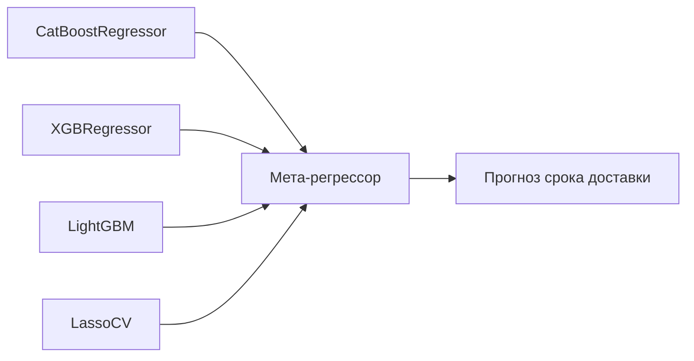

# 🤖📊 Курсовая работа по Машинному обучению: Регрессия срока доставки железнодорожного вагона

## 📌 Постановка задачи

**Цель:** Построение модели машинного обучения для прогнозирования срока доставки железнодорожного вагона по данным о рейсе, грузе, операциях и техническом состоянии

**Целевая переменная (таргет):**  
Срок доставки — колонка `Срок доставки факт` в единицах времени

## 📦 Установка
```bash
git clone https://github.com/BogdanG888G/ML_Course_Work_dataset1
cd ML_Course_Work_dataset1
pip install -r requirements.txt
```

## 🗃️ Данные

**Источник:** Журнал операций и перевозок железнодорожных вагонов с подробной информацией о рейсах, грузах, станциях, ремонтах и операциях. (`Dataset 1`)

**Основные признаки:**
  
* Даты и время начала и окончания рейса
  
* Тип вагона, дорога и станция отправления/назначения
  
* Информация о грузоотправителе и грузополучателе
  
* Операции с вагоном (тип, дата, время, местоположение)
  
* Ремонтные и технические данные вагона
  
* Признаки связанные с предыдущими пробегами и состояниями

**Предобработка:**
- Обработка и масштабирование числовых признаков
- Кодирование категориальных переменных (One-Hot, Label Encoding)
- Работа с временными данными: извлечение дня недели, часа, продолжительности и т.п.
- Обработка пропусков и выбросов

## 🧠 Методы и модели

### 1. Стекинг-ансамбль

```mermaid
graph LR
    A[CatBoostRegressor] --> C[Мета-регрессор]
    B[XGBRegressor] --> C
    D[LightGBM] --> C
    E[LassoCV] --> C
    C --> F[Прогноз срока доставки]

```

## Архитектура решения

### Базовые модели стекинга
| Модель                | Параметры                              |
| --------------------- | -------------------------------------- |
| **CatBoostRegressor** | depth=8, iterations=1500               |
| **XGBRegressor**      | max\_depth=10, learning\_rate=0.05     |
| **LightGBM**          | num\_leaves=127, feature\_fraction=0.7 |
| **LassoCV**           | альфа по кросс-валидации               |


### Мета-модель
```python
from sklearn.linear_model import LassoCV
meta_model = LassoCV(cv=5)

```

# Результаты исследования: Сравнение кастомного ансамбля и AutoML

Для оценки качества и эффективности были использованы две модели: AutoML и собственная разработанная модель. Ниже представлены ключевые метрики, а также время обучения:

## AutoML (H2O)
**Время обучения:** ~18-25 минут  
**Лучшая модель:** Stacked Ensemble  
**Ключевая особенность:** Автоматический feature engineering

---

## Результаты экспериментов

### Сравнение метрик
| Метрика            | Наша модель | AutoML  |
|---------------------|-------------|---------|
| **MAE**             | 0.25        | 0.27    |
| **R²**              | 0.99        | 0.98    |

---

## Технологический стек

### Основные компоненты
- **Модели:**<br>
 CatBoostRegressor • XGBRegressor • LightGBM • LassoCV
- **Ансамбли:**  
  StackingRegressor (sklearn)
- **AutoML:**  
  H2O.ai (для сравнения)
- **Интерпретация:**  
  SHAP • LIME • Permutation Importance
- **Визуализация:**  
  Plotly • Seaborn • Matplotlib
- **Оптимизация:**  
  Optuna • GridSearchCV

---


## Заключение

Сравнительный анализ показал следующие ключевые выводы:

✅ Кастомная модель обеспечивает более высокую точность предсказаний с MAE = 0.25 и R2 = 0.99, что делает её предпочтительным выбором для задач, требующих максимальной точности

✅ AutoML также показал достойные результаты с MAE = 0.32 и R2 = 0.984, при этом затратив около 2 минут на обучение — быстрее, чем кастомная модель (192.6 секунды)

✅ Гибкость и объяснимость: Кастомная модель позволяет лучше настроить архитектуру и интерпретировать предсказания, что особенно важно для выявления ключевых факторов, влияющих на прогнозы

Проект успешно демонстрирует возможности обеих моделей в оптимизации логистики и прогнозировании сроков доставки, позволяя выбрать подходящий подход в зависимости от требований по скорости и точности

